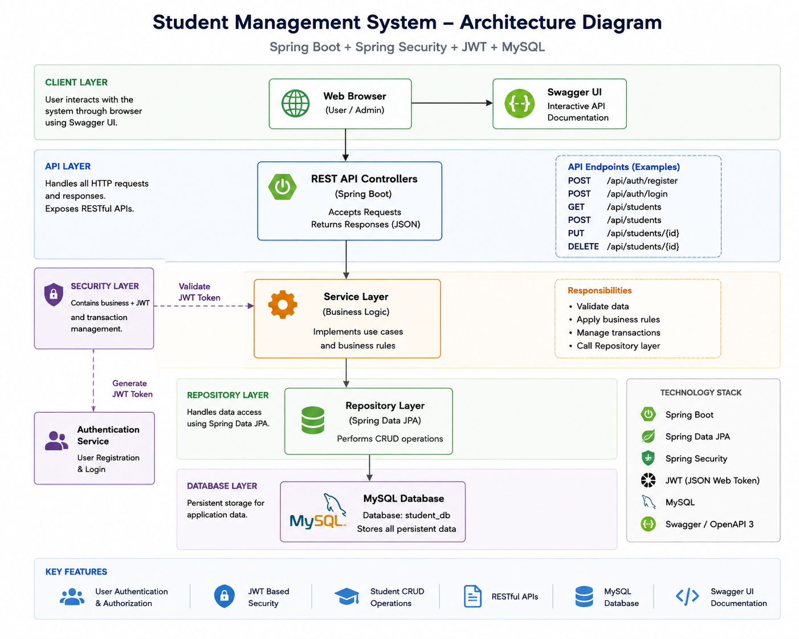

# Student Management System

A secure and containerized Student Management System built using Spring Boot, Spring Data JPA, MySQL, JWT Authentication, Swagger/OpenAPI, and Docker.

## 📌 Project Overview

The Student Management System is a backend application designed to manage student information through RESTful APIs. The application provides secure, role-based authentication using JWT and supports full student data management through protected REST APIs.

## 🚀 Features

- JWT-based authentication with stateless session management
- Role-based access control (USER, ADMIN)
- Student management with full CRUD operations
- Search, sorting, and pagination support
- MySQL database integration
- Spring Data JPA and Hibernate
- Clean DTO layer decoupling API contracts from JPA entities
- Global exception handling with custom exceptions (401 / 404 / 400 / 409 responses)
- Standardized API responses
- Swagger/OpenAPI API documentation
- Docker containerization
- Layered Spring Boot architecture

## ✅ Testing

- 77 unit, controller, and integration tests written using JUnit 5 and Mockito
- 97% instruction coverage, verified via JaCoCo
- Covers the service layer, controllers, JWT filter/util, DTOs, entities, and exception handling

## 🛠️ Tech Stack

| Technology | Usage |
|---|---|
| Java 21 | Programming Language |
| Spring Boot 3.5.4 | Backend Framework |
| Spring Data JPA | Data Access |
| Hibernate | ORM |
| MySQL 8 | Database |
| JWT (jjwt) | Authentication |
| Spring Security | Authorization |
| ModelMapper | Entity-DTO conversion |
| Swagger / OpenAPI | API Documentation |
| JUnit 5 + Mockito | Testing |
| JaCoCo | Test coverage reporting |
| Maven | Build Tool |
| Docker | Containerization |
| Git & GitHub | Version Control |

## 🏗️ System Architecture

The application follows a layered architecture:

```text
Client
   │
   ▼
REST Controller (DTOs)
   │
   ▼
Service Layer (DTO ↔ Entity mapping)
   │
   ▼
Repository Layer
   │
   ▼
MySQL Database
```

### Architecture Diagram


## 🔐 Authentication

All endpoints except `/auth/login`, `/users/register`, and Swagger routes require a valid JWT.

1. Register a user via `POST /users/register`
2. Log in via `POST /auth/login` to receive a JWT
3. Pass the token on subsequent requests as a header:

```
Authorization: Bearer <token>
```

## 📚 API Endpoints

### Auth

| Method | Endpoint | Access | Description |
|---|---|---|---|
| POST | `/auth/login` | Public | Authenticate and receive a JWT |

### Users

| Method | Endpoint | Access | Description |
|---|---|---|---|
| POST | `/users/register` | Public | Register a new user |

### Students

| Method | Endpoint | Access | Description |
|---|---|---|---|
| GET | `/students` | USER, ADMIN | Get all students |
| GET | `/students/{id}` | USER, ADMIN | Get a student by ID |
| GET | `/students/search/{name}` | USER, ADMIN | Search students by name |
| GET | `/students/page?page=&size=` | USER, ADMIN | Get students with pagination |
| GET | `/students/sort/{field}` | USER, ADMIN | Get students sorted ascending by field |
| GET | `/students/sortDesc/{field}` | USER, ADMIN | Get students sorted descending by field |
| GET | `/students/pageSort?page=&size=&field=` | USER, ADMIN | Get students with pagination + sorting |
| POST | `/students` | ADMIN | Create a student |
| PUT | `/students/{id}` | ADMIN | Update a student |
| DELETE | `/students/{id}` | ADMIN | Delete a student |

Full interactive API documentation is available via Swagger once the app is running, at `/swagger-ui.html`.

## ⚙️ Getting Started

### Prerequisites

- Java 21
- Maven
- MySQL 8 (or Docker, to run it in a container)

### Environment Variables

The application reads the following from the environment:

| Variable | Description |
|---|---|
| `DB_URL` | MySQL JDBC URL (defaults to `jdbc:mysql://localhost:3307/student_db`) |
| `DB_USERNAME` | MySQL username (defaults to `root`) |
| `DB_PASSWORD` | MySQL password |
| `JWT_SECRET` | Secret key used to sign JWTs |

### Run locally

```bash
git clone https://github.com/suresh-1219/student-management-system.git
cd student-management-system

export DB_PASSWORD=your_db_password
export JWT_SECRET=your_jwt_secret

mvn spring-boot:run
```

The application runs on `http://localhost:9090`.

### Run with Docker

```bash
mvn clean package -DskipTests
docker build -t student-management-system .
docker run -p 9090:9090 \
  -e DB_URL=jdbc:mysql://host.docker.internal:3307/student_db \
  -e DB_USERNAME=root \
  -e DB_PASSWORD=your_db_password \
  -e JWT_SECRET=your_jwt_secret \
  student-management-system
```

### Run tests + coverage report

```bash
mvn test
```

The JaCoCo coverage report is generated at `target/site/jacoco/index.html`.

## 📄 License

This project was built as a personal portfolio project.
